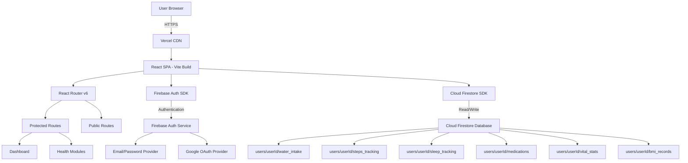
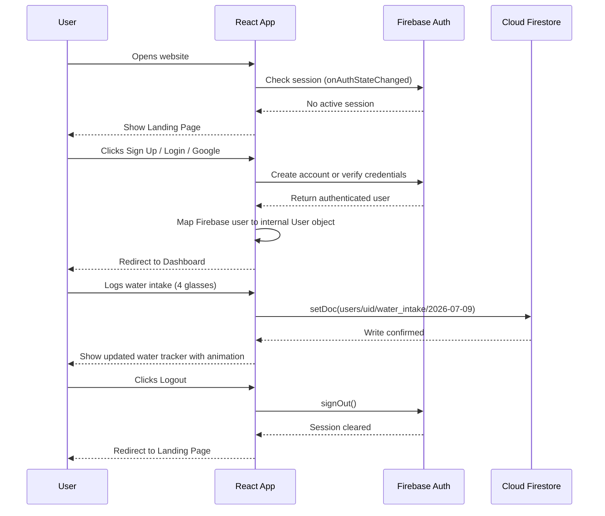

# Arogya Care

A modern, full-featured health and wellness tracking platform built as a summer project to help users take control of their daily health habits, fitness goals, and mental wellbeing — all from a single dashboard.

---

## Table of Contents

- [About the Project](#about-the-project)
- [Key Features](#key-features)
- [System Architecture](#system-architecture)
- [User Flow](#user-flow)
- [Tech Stack](#tech-stack)
- [Project Structure](#project-structure)
- [Getting Started](#getting-started)
- [Environment Variables](#environment-variables)
- [Deployment](#deployment)
- [Security Practices](#security-practices)
- [Screenshots](#screenshots)
- [Contributing](#contributing)
- [License](#license)

---

## About the Project

Arogya Care was created to solve a common problem: health data is scattered across multiple apps, making it hard to build consistent habits. This platform brings everything together — water intake, step counting, sleep tracking, medication reminders, BMI monitoring, workout plans, mental wellness tools, and more — into a single, beautifully designed interface.

The application supports multiple users with secure authentication, stores health data per user in a cloud database, and works across all devices with a responsive design.

---

## Key Features

### Health Tracking
- **Water Intake Tracker** — Log daily water consumption against a configurable goal. Weekly trend visualization included.
- **Steps Tracker** — Manual input or simulated device/GPS tracking with daily and weekly progress charts.
- **Sleep Tracker** — Record sleep duration, quality, and patterns. Weekly sleep trend analysis with personalized tips.
- **BMI and Vital Stats** — Calculate BMI, log blood pressure, heart rate, body temperature, and weight over time.

### Medical Tools
- **Medication Reminder** — Add, manage, and track daily medications. Mark doses as taken with date-based logging.
- **Report Decoder** — Upload medical reports and get simplified explanations of complex medical terminology.
- **Menstruation Tracker** — Cycle tracking with period predictions, symptom logging, and health insights.

### Fitness and Wellness
- **Workout and Diet Plans** — Curated exercise routines and meal plans based on health goals.
- **Mental Wellness** — Guided breathing exercises, mood journaling, and stress management techniques.
- **AI Mood Companion** — Chat-based mental health support powered by AI for real-time emotional guidance.
- **AI Health Assistant** — Ask health-related questions and receive informative responses.

### Engagement and Gamification
- **Streak System** — Earn streaks for daily activity consistency. Tracks current streak, longest streak, and total active days.
- **Badge Collection** — Unlock achievement badges at 7, 30, 100, 365, 1000, 2000, 3000, 4000, and 5000 day milestones.
- **Achievements Page** — Visual gallery of all earned and upcoming badges with progress indicators.

### Safety and Utilities
- **Emergency Button** — One-tap access to emergency services and saved emergency contacts.
- **Emergency Contacts Manager** — Save and manage emergency contact numbers locally.
- **Nearby Hospitals Finder** — Locate nearby medical facilities using map integration.

### Design and Accessibility
- **Multi-Theme System** — Four curated themes: Deep Space (violet), Emerald Care (green), Sunset Glow (orange), and Cyber Neon (pink).
- **Responsive Layout** — Optimized for mobile, tablet, and desktop screens.
- **Smooth Page Transitions** — Animated route transitions with fade and slide effects using Framer Motion.
- **Glassmorphism UI** — Modern frosted glass card design with depth effects and ambient glow accents.

---

## System Architecture

The application follows a client-side rendered single-page application (SPA) architecture with a cloud backend for authentication and data persistence.



### Data Flow



---

## Tech Stack

| Layer | Technology | Purpose |
|-------|-----------|---------|
| Frontend Framework | React 18 | Component-based UI with hooks |
| Build Tool | Vite 5 | Fast development server and optimized production builds |
| Language | TypeScript | Type safety across the entire codebase |
| Routing | React Router v6 | Client-side navigation with protected routes |
| Styling | Tailwind CSS 3 | Utility-first CSS with custom theme tokens |
| Animations | Framer Motion | Page transitions, hover effects, and micro-interactions |
| Icons | Lucide React | Consistent, clean icon set across all components |
| Authentication | Firebase Auth | Email/password, Google OAuth, session management |
| Database | Cloud Firestore | NoSQL document database with per-user data isolation |
| Hosting | Vercel | Automatic deployments from GitHub with edge CDN |

---

## Project Structure

```
arogya-care/
├── public/                          # Static assets
├── src/
│   ├── components/
│   │   ├── auth/
│   │   │   └── ProtectedRoute.tsx   # Route guard — redirects unauthenticated users
│   │   ├── chat/
│   │   │   ├── ChatbotIcon.tsx      # Floating chatbot button
│   │   │   └── ChatWidget.tsx       # Chat interface for AI assistant
│   │   ├── common/
│   │   │   ├── HealthCard.tsx       # Reusable 3D health feature card
│   │   │   └── PageTransition.tsx   # Animated page transition wrapper
│   │   ├── dashboard/
│   │   │   ├── SleepTracker.tsx     # Sleep logging and weekly trends
│   │   │   ├── StepsTracker.tsx     # Step counter with goal tracking
│   │   │   ├── StreakDisplay.tsx     # Current streak and badge progress
│   │   │   └── WaterTracker.tsx     # Water intake with visual fill animation
│   │   ├── gamification/
│   │   │   ├── BadgeUnlockModal.tsx # Celebration modal when badges unlock
│   │   │   └── EmergencyButton.tsx  # Floating emergency access button
│   │   └── layout/
│   │       ├── Header.tsx           # Navigation bar with theme selector
│   │       └── Footer.tsx           # Site footer with credits
│   │
│   ├── contexts/
│   │   ├── AuthContext.tsx          # Global authentication state and methods
│   │   ├── StreakContext.tsx         # Streak tracking and badge management
│   │   ├── ThemeContext.tsx         # Multi-theme state (4 color schemes)
│   │   └── ToastContext.tsx         # Toast notification system
│   │
│   ├── hooks/
│   │   ├── useFirebaseAuth.ts       # Firebase Auth SDK wrapper
│   │   ├── useHealthData.ts         # Firestore CRUD for all health modules
│   │   └── useLanguage.ts           # Internationalization helper
│   │
│   ├── lib/
│   │   └── firebase.ts             # Firebase app initialization and config
│   │
│   ├── pages/
│   │   ├── LandingPage.tsx          # Public homepage with auth forms
│   │   ├── LoginPage.tsx            # Login route (redirects to LandingPage)
│   │   ├── Dashboard.tsx            # Main dashboard with all trackers
│   │   ├── BMIPage.tsx              # BMI calculator and vital stats
│   │   ├── WaterTrackerPage.tsx     # Detailed water tracking view
│   │   ├── MedicationsPage.tsx      # Medication management
│   │   ├── WorkoutPage.tsx          # Exercise and diet plans
│   │   ├── MenstruationPage.tsx     # Menstrual cycle tracker
│   │   ├── MentalWellnessPage.tsx   # Mental health tools and journaling
│   │   ├── ReportDecoderPage.tsx    # Medical report analysis
│   │   ├── AchievementsPage.tsx     # Badge gallery and progress
│   │   ├── HabitTrackerPage.tsx     # Daily habit builder
│   │   ├── NearbyHospitalsPage.tsx  # Hospital and clinic locator
│   │   ├── AIAssistantPage.tsx      # AI health question answering
│   │   ├── AIMoodCompanionPage.tsx  # AI emotional support chat
│   │   ├── EmergencyContactsPage.tsx # Emergency contact manager
│   │   └── LiveDeploymentPage.tsx   # Deployment status page
│   │
│   ├── styles/                      # Additional style modules
│   ├── types/                       # TypeScript type definitions
│   ├── utils/                       # Utility functions
│   ├── App.tsx                      # Root component with routing
│   ├── main.tsx                     # Application entry point
│   └── index.css                    # Global styles and theme tokens
│
├── .env.example                     # Template for environment variables
├── index.html                       # HTML entry point
├── package.json                     # Dependencies and scripts
├── tailwind.config.js               # Tailwind CSS configuration
├── vite.config.ts                   # Vite build configuration
├── vercel.json                      # Vercel deployment settings
└── tsconfig.json                    # TypeScript compiler configuration
```

---

## Getting Started

### Prerequisites

- Node.js version 18 or higher
- npm (comes with Node.js)
- A Firebase project (free tier is sufficient)

### Installation

1. Clone the repository:

```bash
git clone https://github.com/krishna-kt-thakkar/Arogya-Care.git
cd Arogya-Care
```

2. Install dependencies:

```bash
npm install
```

3. Create a `.env` file based on the template:

```bash
cp .env.example .env
```

4. Fill in your Firebase credentials in the `.env` file (see the Environment Variables section below).

5. Start the development server:

```bash
npm run dev
```

The application will be available at `http://localhost:5173`.

### Build for Production

```bash
npm run build
```

The optimized output will be generated in the `dist/` directory.

---

## Environment Variables

Create a `.env` file in the project root with the following keys. All Firebase values are obtained from your Firebase Console under Project Settings.

| Variable | Description |
|----------|-------------|
| `VITE_FIREBASE_API_KEY` | Firebase Web API key |
| `VITE_FIREBASE_AUTH_DOMAIN` | Firebase Auth domain (e.g., yourproject.firebaseapp.com) |
| `VITE_FIREBASE_PROJECT_ID` | Firebase project identifier |
| `VITE_FIREBASE_STORAGE_BUCKET` | Firebase storage bucket URL |
| `VITE_FIREBASE_MESSAGING_SENDER_ID` | Firebase Cloud Messaging sender ID |
| `VITE_FIREBASE_APP_ID` | Firebase app identifier |
| `VITE_OPENAI_API_KEY` | OpenAI API key for AI Assistant features |
| `VITE_DEEPSEEK_API_KEY` | DeepSeek API key for AI Mood Companion |
| `VITE_ELEVENLABS_API_KEY` | ElevenLabs API key for text-to-speech features |
| `GOMAPS_API_KEY` | GoMaps API key for nearby hospital search |

The application gracefully handles missing keys — authentication and data features fall back to local session storage so the interface remains fully usable during development without any backend configuration.

---

## Deployment

The project is deployed on Vercel with automatic deployments triggered on every push to the `main` branch.

### Steps to Deploy

1. Push your code to a GitHub repository.
2. Go to [vercel.com](https://vercel.com) and import the repository.
3. Set the **Framework Preset** to Vite.
4. Add all environment variables from the table above in the Vercel project settings.
5. Deploy. Vercel will build and host the application automatically.

### Vercel Configuration

The project includes a `vercel.json` that handles client-side routing:

```json
{
  "rewrites": [
    { "source": "/(.*)", "destination": "/index.html" }
  ]
}
```

This ensures that all routes (like `/dashboard`, `/bmi`, `/medications`) are properly served by the React Router instead of returning 404 errors.

---

## Security Practices

- **No secrets in source code** — All API keys and credentials are stored in environment variables and excluded from version control via `.gitignore`.
- **Firebase Security Rules** — Cloud Firestore uses per-user security rules. Each user can only read and write documents under their own `users/{userId}/` path.
- **Authentication enforcement** — All health data routes are wrapped in a `ProtectedRoute` component that redirects unauthenticated visitors to the login page.
- **Input validation** — Form inputs are validated on the client side before submission.
- **Session management** — Firebase Auth handles token refresh and session persistence automatically.

### Recommended Firestore Security Rules

```javascript
rules_version = '2';
service cloud.firestore {
  match /databases/{database}/documents {
    match /users/{userId}/{document=**} {
      allow read, write: if request.auth != null && request.auth.uid == userId;
    }
  }
}
```

---

## Screenshots

The application features a dark-themed glassmorphism design with multiple color scheme options. Key screens include:

- **Landing Page** — Clean hero section with login/signup forms
- **Dashboard** — Health trackers (steps, sleep, water) with 3D-styled feature cards
- **Health Modules** — Individual pages for BMI, medications, workouts, mental wellness, and more
- **Theme Selector** — Switch between Deep Space, Emerald Care, Sunset Glow, and Cyber Neon themes

---

## Contributing

Contributions are welcome. To contribute:

1. Fork the repository.
2. Create a feature branch: `git checkout -b feature/your-feature-name`.
3. Commit your changes: `git commit -m "Add your feature description"`.
4. Push to your fork: `git push origin feature/your-feature-name`.
5. Open a Pull Request against the `main` branch.

Please ensure your code passes the build (`npm run build`) before submitting.

---

## License

This project is open source and available under the [MIT License](LICENSE).

---

Built as a Summer Project by Krishna KT Thakkar.